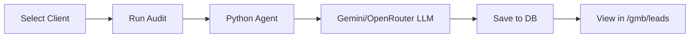

# Forma Digital App

A social media scheduling and **Local Business Intelligence** platform built with **NestJS** (Backend), **Next.js** (Frontend), **Harv3st** (Google Maps Scraper), and **Python Agent V2** (AI Analysis).

## 🚀 Key Features

| Feature | Description |
|---------|-------------|
| 📅 **Social Scheduling** | Multi-platform post scheduling (Instagram, Facebook) |
| 🗺️ **GMB Intelligence** | Local competitor analysis via Map + SerpApi |
| 🤖 **AI Audit** | Blue Ocean strategy audits powered by Gemini/OpenRouter |
| 📋 **Leads CRM** | Automatic lead capture from audits with tier scoring |
| 📊 **PDF Reports** | Exportable audit reports with SWOT, Action Plans |
| 🔍 **Harv3st Scraper** | Google Maps business scraping with Playwright |

---

## 🏗 Architecture

```
forma-digital-app/
├── apps/
│   ├── backend/        # NestJS API (Port 3000)
│   └── frontend/       # Next.js 16 (Port 3001)
├── services/
│   └── harv3st/        # Python Google Maps Scraper (Port 5050)
├── scripts/
│   └── agent_v2/       # Python AI Agent (LLM, Scraper, Sync)
└── .github/agents/     # AI Persona Definitions
```

### Tech Stack

| Layer | Technology |
|-------|------------|
| Backend | NestJS 11, Prisma, PostgreSQL, BullMQ |
| Frontend | Next.js 16, React 19, TailwindCSS v4 |
| Harv3st | Python 3.10+, Playwright, FastAPI |
| AI Agent | Python 3.11+, Gemini, OpenRouter, Ollama |
| Design | Neo-Brutalist (Bauhaus) |

---

## 🚀 Getting Started

### Prerequisites
- Node.js (v18+)
- Python 3.10+ (for Harv3st)
- Python 3.11+ (for AI Agent)
- Docker Desktop (PostgreSQL & Redis)

### Installation

```bash
# 1. Clone & install
npm install

# 2. Start infrastructure
docker compose up -d

# 3. Setup database
cd apps/backend
npx prisma db push
npx prisma db seed

# 4. Setup Harv3st (Google Maps Scraper)
cd services/harv3st
pip install -r requirements.txt
playwright install

# 5. Setup Python agent
cd scripts/agent_v2
pip install -r requirements.txt
cp .env.example .env  # Add your API keys
```

### Running the App

The easiest way is to use the launcher script:

```bash
# Start all services (Backend, Frontend, Harv3st)
dev.bat
```

Or manually:

```bash
# Harv3st (Port 5050)
cd services/harv3st && python manager.py server

# Backend (Port 3000)
cd apps/backend && npm run start:dev

# Frontend (Port 3001)
cd apps/frontend && npm run dev -- -p 3001
```

To stop all services:

```bash
stop.bat
```

---

## 🔍 Harv3st - Google Maps Scraper

Location: `services/harv3st/`

Harv3st is a Python-based Google Maps scraper that uses Playwright for browser automation.

### Features
- Scrape business listings from Google Maps
- Extract: name, address, phone, website, rating, reviews
- Automatic deduplication
- REST API for integration

### API Endpoints

| Endpoint | Description |
|----------|-------------|
| `GET /api/status` | Health check |
| `POST /api/search` | Search businesses by query |
| `GET /api/results/{job_id}` | Get search results |

### Environment Variables

```env
# In apps/backend/.env
HARV3ST_URL=http://localhost:5050
```

For more details, see `services/harv3st/README.md`.

---

## 🗺️ GMB Intelligence Module

Navigate to `/gmb` to access:

1. **Map Tab**: Search competitors by keyword + location
2. **Analysis Tab**: View competitor metrics and tier classification
3. **Audit Tab**: Run AI-powered Blue Ocean audit
4. **Report Tab**: Generate PDF with SWOT, Gap Analysis, Action Plan

### AI Audit Flow



---

## 🤖 Python Agent V2

Location: `scripts/agent_v2/`

### CLI Usage

```bash
# Search mode (find businesses)
python main.py --mode search --query "Kiosco" --location "Buenos Aires" --limit 10

# Audit mode (analyze specific business)
python main.py --mode audit --input payload.json
```

### Environment Variables

```env
GEMINI_API_KEY=your_key
OPENROUTER_API_KEY=your_key
SERPAPI_API_KEY=your_key
BACKEND_URL=http://localhost:3001
```

---

## 📋 Leads CRM

Navigate to `/gmb/leads` to:
- View all saved leads/clients
- Filter by type (LEAD / CLIENT)
- View last audit for each client
- Create projects from leads

---

## 🧪 Testing

```bash
# Backend (Jest)
cd apps/backend && npm test

# Python Agent (pytest)
cd scripts/agent_v2 && python -m pytest tests/ -v
```

---

## 📁 Agent Personas

AI behavior is defined in `.github/agents/`:

| Agent | Role |
|-------|------|
| `api-agent.md` | Backend NestJS specialist |
| `frontend-agent.md` | Next.js + Neo-Brutalist design |
| `strategy-agent.md` | Blue Ocean business intelligence |
| `test-agent.md` | Testing & QA |
| `docs-agent.md` | Documentation |
