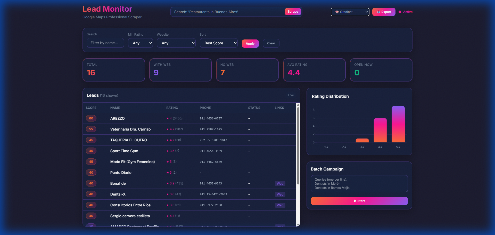

# Harv3st

Google Maps lead scraper with professional dashboard.

> **Nota**: Este servicio es parte de `forma-digital-app` y se ejecuta en el puerto 5050.



## Quick Start (dentro de forma-digital-app)

```bash
# Desde forma-digital-app/services/harv3st/
python manager.py server

# O usar el script unificado desde forma-digital-app/
dev.bat  # Inicia backend, frontend y harv3st juntos
```

## Setup

```bash
# Requisitos: Python 3.10+
pip install -r requirements.txt
playwright install chromium
```

## Features

- **Data Extraction**: Name, rating, phone, website, address, hours, photos
- **Lead Scoring**: Rule-based scoring to prioritize prospects (no website = high score)
- **Batch Mode**: Run multiple queries sequentially
- **Filters**: By rating, website, search term
- **CSV Export**: One-click download
- **Multi-language**: English / Español

## Quick Start

```bash
# Option 1: Double-click
run_dashboard.bat

# Option 2: Command line
python manager.py server
```

Open `http://localhost:5050`

## API

| Endpoint | Method | Description |
|----------|--------|-------------|
| `/api/search` | POST | Start scraping `{"query": "..."}` |
| `/api/data` | GET | Get all leads |
| `/api/data/scored` | GET | Get leads sorted by score |
| `/api/export/csv` | GET | Download CSV |
| `/api/campaign` | POST | Batch queries `{"queries": [...]}` |

## Requirements

- Python 3.8+
- Playwright (`python -m playwright install chromium`)

## Install

```bash
pip install -r requirements.txt
python -m playwright install chromium
```

## Project Structure

```
services/harv3st/           # Dentro de forma-digital-app
├── app/
│   ├── main_server.py    # Flask API
│   └── scraper.py        # Playwright scraper
├── core/
│   ├── parser.py         # Data extraction
│   ├── scoring.py        # Lead scoring
│   └── campaign.py       # Batch mode
├── templates/
│   └── dashboard.html    # UI
├── data/
│   └── leads.json        # Stored data
├── config.py
├── manager.py            # Entry point
└── requirements.txt
```

## Integración con forma-digital-app

El backend de NestJS se conecta a Harv3st via HTTP:
- Variable de entorno: `HARV3ST_URL=http://localhost:5050`
- Endpoint usado: `POST /api/search`, `GET /api/data`

El frontend muestra el estado de conexión en `/prospect`.

## Themes

- ✅ Gradient Mesh (active)
- ⏳ Cyberpunk Neon
- ⏳ Scandinavian Minimal

## License

MIT

